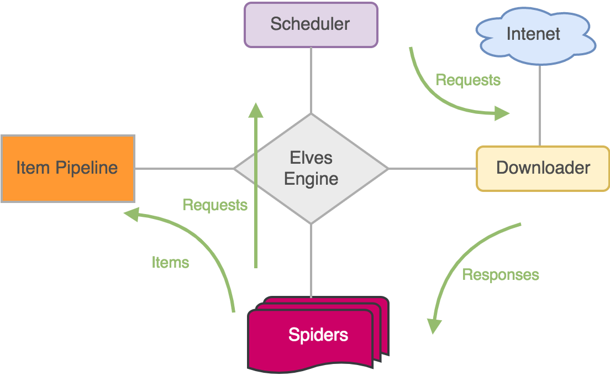
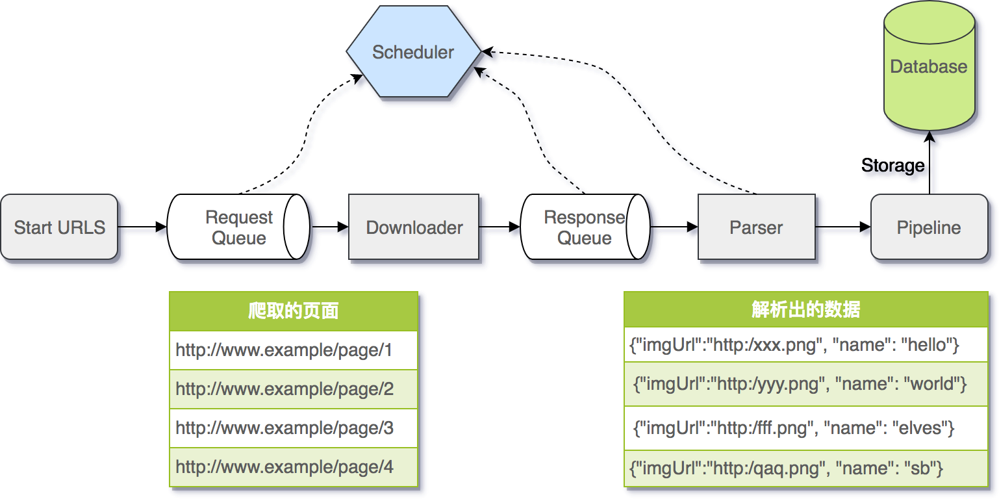

# Elves

一个轻量级的爬虫框架设计与实现，[博文分析](https://blog.biezhi.me/2018/01/design-and-implement-a-crawler-framework.html)。


## 特性

- 事件驱动
- 易于定制
- 多线程执行
- `CSS` 选择器和 `XPath` 支持

## 架构图



## 调用流程图



## 快速上手

搭建一个爬虫程序需要进行这么几步操作

1. 编写一个爬虫类继承自 `Spider`
2. 设置要抓取的 URL 列表
3. 实现 `Spider` 的 `parse` 方法
4. 添加 `Pipeline` 处理 `parse` 过滤后的数据

举个栗子:

```java
public class DoubanSpider extends Spider {

    public DoubanSpider(String name) {
        super(name);
    }

    @Override
    public void onStart(Config config) {
        this.startUrls(
                "https://movie.douban.com/tag/爱情",
                "https://movie.douban.com/tag/喜剧",
                "https://movie.douban.com/tag/动画",
                "https://movie.douban.com/tag/动作",
                "https://movie.douban.com/tag/史诗",
                "https://movie.douban.com/tag/犯罪");
        this.addPipeline((Pipeline<List<String>>) (item, request) -> log.info("保存到文件: {}", item));
    }

    public Result parse(Response response) {
        Result<List<String>> result   = new Result<>();
        Elements             elements = response.body().css("#content table .pl2 a");

        List<String> titles = elements.stream().map(Element::text).collect(Collectors.toList());
        result.setItem(titles);

        // 获取下一页 URL
        Elements nextEl = response.body().css("#content > div > div.article > div.paginator > span.next > a");
        if (null != nextEl && nextEl.size() > 0) {
            String  nextPageUrl = nextEl.get(0).attr("href");
            Request nextReq     = this.makeRequest(nextPageUrl, this::parse);
            result.addRequest(nextReq);
        }
        return result;
    }

}

public static void main(String[] args) {
    DoubanSpider doubanSpider = new DoubanSpider("豆瓣电影");
    Elves.me(doubanSpider, Config.me()).start();
}
```

## 爬虫例子

- [豆瓣电影](https://github.com/biezhi/elves/blob/master/src/test/java/io/github/biezhi/elves/examples/DoubanExample.java)
- [网易新闻]()
- [糗事百科]()
- [妹。。。妹子图](https://github.com/biezhi/elves/blob/master/src/test/java/io/github/biezhi/elves/examples/MeiziExample.java)

## 开源协议

[MIT](https://github.com/biezhi/elves/blob/master/LICENSE)